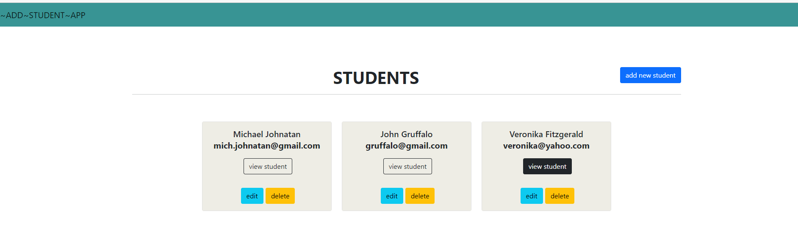

# Student-CRUD-App
Full Stack CRUD (Create, Read, Update, Delete) Application.

## Back-End:
SpringBoot, Spring Data JPA

## Front-End:
ReactJS, Bootstrap 4

## Database:
H2

## C-R-U-D MOCKUPS:
1. Add Student

2. View Student

3. Edit Student

4. View Student

